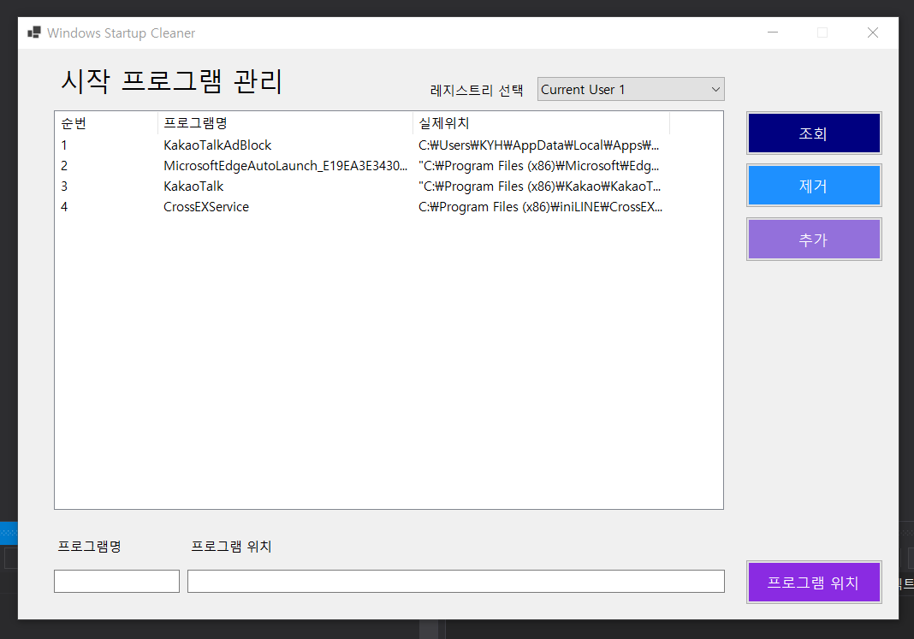

## 📕 프로젝트 개요(Introduce Project)

## Windows Startup Cleaner

* 윈도우(Windows) 시작 프로그램 리스트를 정리합니다.

## 🏷️ 기능(Function)

1. [윈도우(Windows) 시작 프로그램 리스트 정리](#윈도우(Windows)-시작-프로그램-리스트-정리)

### 세부 기능(Function Detail)

#### 윈도우(Windows) 시작 프로그램 리스트 정리

1. 작업 관리자 `시작프로그램` 리스트를 정리합니다.

## 💡 사용법(Tip)
 1. 관리자 권한으로 프로그램을 실행합니다.
 2. 시작 프로그램 위치가 저장된 레지스트리를 선택하여 조회합니다.
 3. 정리할 프로그램을 선택하고 제거 버튼을 누릅니다.
 4. 하단의 프로그램 명과 경로를 입력하여 추가 버튼으로 시작 프로그램을 등록할 수도 있습니다.

## 💻 개발 환경(Develop Environment)

### 세부 환경(Environment Detail)

* ✔ OS : 
  * 🕒 Version : `10 Pro`
* ✔ Language : 
* ✔ Dependency : 
  * 🕒 Version : `5.0`

## 📖 비고(Remark)
* 시작 프로그램 클리너
